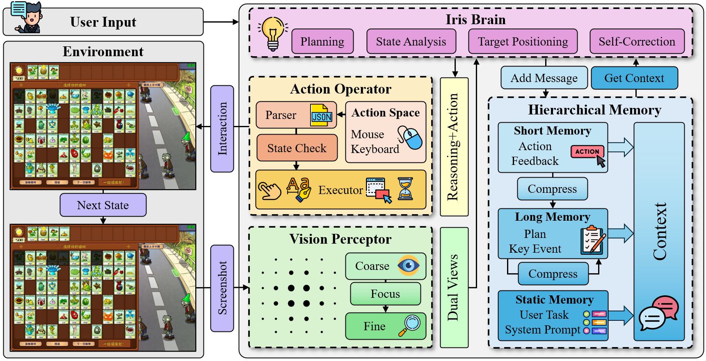
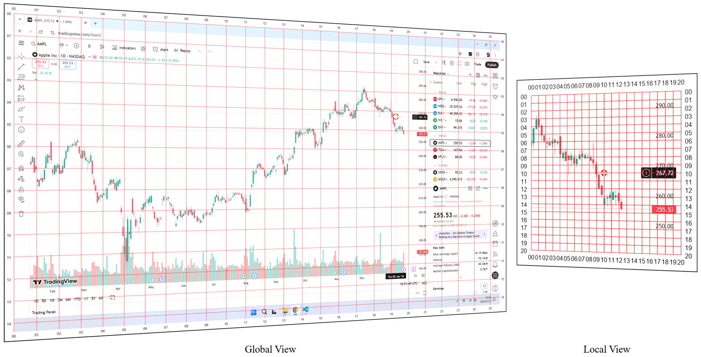
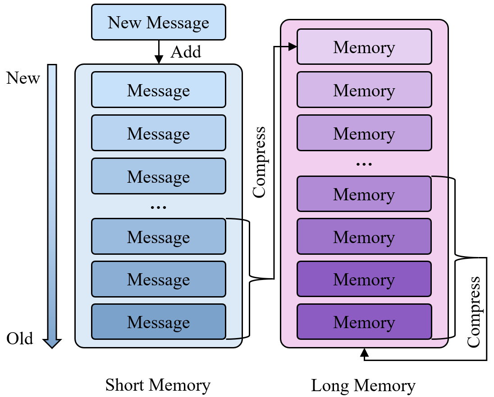

<div align="center">
  <pre>
██╗██████╗ ██╗███████╗
██║██╔══██╗██║██╔════╝
██║██████╔╝██║███████╗
██║██╔══██╗██║╚════██║
██║██║  ██║██║███████║
╚═╝╚═╝  ╚═╝╚═╝╚══════╝</pre>

[](LICENSE)
[](https://www.python.org/)
<a href="https://arxiv.org/pdf/xxxx.xxxx" target="_blank"></a>
[](https://github.com/black-yt/IrisGUI)&#160;

**Lightweight Autonomous Desktop GuiAgent. Your AI-powered hands and eyes for desktop automation.**  

*Lightweight • Minimal Code • Minimal Dependencies 🍃*

*Visual Perception • Self-Correcting • Infinite Memory 💪🏻*
</div>


## 🚀 What is Iris?

**Iris** is an intelligent agent designed to navigate your operating system just like a human does. It doesn't just blindly run scripts; it **sees** the screen, **thinks** about what to do, and **acts** with precision.

Iris is **lightweight**, with **minimal code** and **dependencies**, requiring only a **single API key**. Yet, it packs a punch with:
*   **Visual Perception** 👁️
*   **Self-Correcting** 🛡️
*   **Infinite Memory** 🧠

Powered by a robust **ReAct (Reasoning + Acting)** loop, Iris can handle complex workflows, recover from errors, and remember context over long periods thanks to its hierarchical memory system.

---

## 🆕 Latest News

🚩 **Update** (2026-01-16) We release **Iris-v1.0**.

---

## 🧠 Architecture

Iris operates on a cycle of **Reasoning**, **Action**, **Observation** and **Reflection**. Here's how the magic happens:

<p align="center">
  
</p>

A **dynamic focusing view** strategy is adopted to improve positioning accuracy and action efficiency.

<p align="center">
  
</p>

**Hierarchical memory** can effectively avoid context explosion and prevent task forgetting.

<p align="center">
  
</p>

---

## ✨ Key Features

| Feature | Description |
| :--- | :--- |
| 🍃 **Quick Installation**   | Only need to install **a few** dependencies and configure **an** API.                               |
| 👁️ **Dynamic Focus Vision** | Uses **Global** (coarse) and **Local** (fine) views to locate elements with pixel-perfect accuracy. |
| 🧠 **Hierarchical Memory**  | Smartly compresses history into **Short-term** and **Long-term** layers. No more token overflow!    |
| 🛡️ **Self-Correction**      | Verifies cursor position before clicking. If it misses, it adjusts and tries again.                 |
| 🎮 **Human-Like Control**   | Smooth mouse movements, typing, scrolling, and even drag-and-drop support.                          |
| 📺 **Live Debug Mode**      | Watch Iris think and act in real-time with a dedicated GUI dashboard.                               |

---

## 🎮 Cases

* **Task**: `玩一局植物大战僵尸`

https://github.com/user-attachments/assets/097baadc-e01f-441c-973d-f1260656d19a

<br>

* **Task**: `Open Google Chrome and search for Shanghai's weather`

https://github.com/user-attachments/assets/067b6fb4-d242-4b4b-b4e1-696eb170c3d2

<br>

* **Task**: `Open Story.txt and write a short story of 100 words`

https://github.com/user-attachments/assets/47c928c7-5226-4d9b-b5ff-dff41d17f874

---

## ⚡ Quick Start

Ready to let Iris take the wheel? Follow these steps to get started in minutes!

### 1. Clone the Repository
```bash
git clone https://github.com/black-yt/IrisGUI.git
cd IrisGUI
```

### 2. Install Dependencies
Make sure you have Python 3.10+ installed.
```bash
pip install -r requirements.txt
```

### 3. Configure Environment
Create a `.env` file in the root directory (copy from [`.env.example`](.env.example)) and add your LLM credentials:
```ini
LLM_API_ENDPOINT="https://base-url/v1"
LLM_API_KEY="sk-your-api-key-here"
LLM_MODEL_NAME="gemini-3-pro"
```

### 4. Run Iris
```bash
python main.py
```

> **💡 Tip:** To stop Iris in an emergency, press **ESC** three times quickly! 🛑

---

## 📬 Contact

- 💬 **GitHub Issues**: Please open an issue for bug reports or feature requests

- 📧 **Email**: [xu_wanghan@sjtu.edu.cn](https://black-yt.github.io/)

---

## 📜 Citation

If you would like to cite our work, please use the following BibTeX.

```bib
Coming soon...
```

---

## 🌟 Star History

If you find this work helpful, please consider to **star⭐** this [repo](https://github.com/InternScience/SGI-Bench). Thanks for your support! 🤩

[](https://github.com/InternScience/SGI-Bench/stargazers)

[](https://www.star-history.com/#InternScience/SGI-Bench&TIGER-AI-Lab/MMLU-Pro&MMMU-Benchmark/MMMU&idavidrein/gpqa&SuperGPQA/SuperGPQA&type=date&legend=top-left)

<p align="right"><a href="#top">🔝Back to top</a></p>
