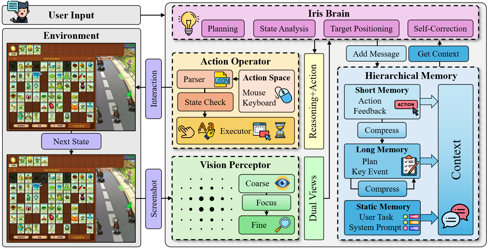
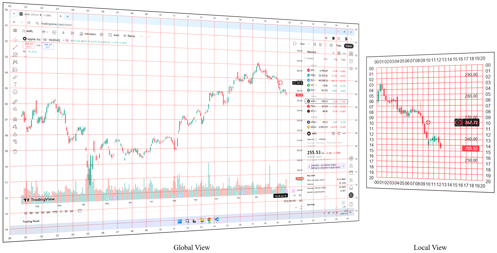
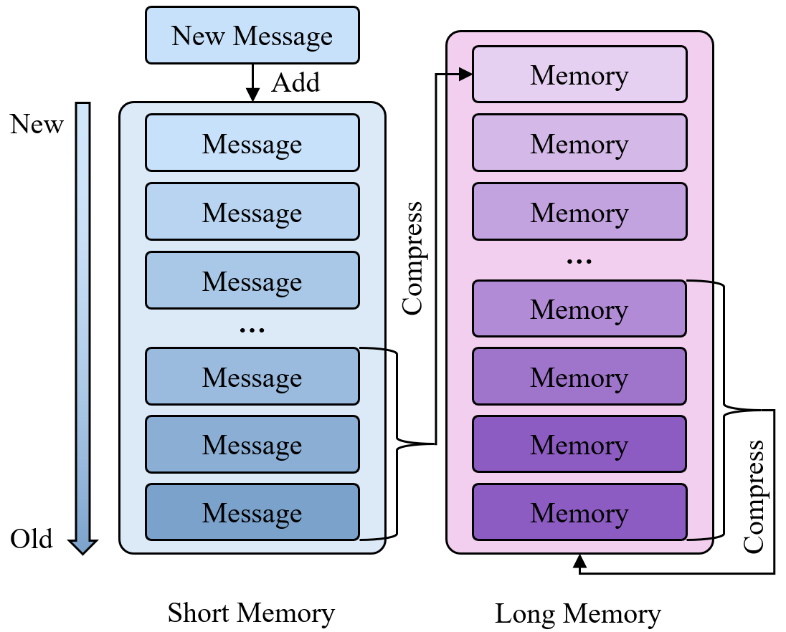

<div align="center">
  <pre>
██╗██████╗ ██╗███████╗
██║██╔══██╗██║██╔════╝
██║██████╔╝██║███████╗
██║██╔══██╗██║╚════██║
██║██║  ██║██║███████║
╚═╝╚═╝  ╚═╝╚═╝╚══════╝</pre>

[](LICENSE)
[](https://www.python.org/)
[](https://github.com/black-yt/IrisGUI)&#160;
<!-- <a href="https://arxiv.org/pdf/xxxx.xxxx" target="_blank"></a> -->

**A Lightweight Desktop GUI Agent via Dynamic Focus Vision and Hierarchical Memory**  

*Lightweight • Minimal Code • Minimal Dependencies 🍃*

*Visual Perception • Infinite Memory • Long Interaction 💪🏻*
</div>


## 🚀 What is Iris?

**Iris** is an intelligent agent designed to navigate your operating system just like a human does. It doesn't just blindly run scripts; it **sees** the screen, **thinks** about what to do, and **acts** with precision.

Iris is **lightweight**, with **minimal code** and **dependencies**, requiring only a **single API key**. Yet, it packs a punch with:
*   **Visual Perception** 👁️
*   **Infinite Memory** 🧠
*   **Long Interaction** 🔄

Powered by a robust **ReAct (Reasoning + Acting)** loop, Iris can handle complex workflows, recover from errors, and remember context over long periods thanks to its hierarchical memory system.

---

## 🆕 Latest News

🚩 **Update** (2026-04-29) Iris now supports OpenAI-compatible native tool calling, safe multi-tool GUI actions, a cross-platform terminal task launcher, structured loop output, traceable debug logs, and token-based memory compression.

🚩 **Update** (2026-01-18) We release **Iris-v1.0**.

---

## 🧠 Architecture

Iris operates on a cycle of **Reasoning**, **Action**, **Observation** and **Reflection**. Here's how the magic happens:

<p align="center">
  
</p>

A **dynamic focusing view** strategy is adopted to improve positioning accuracy and action efficiency.

<p align="center">
  
</p>

**Hierarchical memory** can effectively avoid context explosion and prevent task forgetting.

<p align="center">
  
</p>

---

## ✨ Key Features

| Feature | Description |
| :--- | :--- |
| 🍃 **Quick Installation**   | Only need to install **a few** dependencies and configure **an** API.                               |
| 👁️ **Dynamic Focus Vision** | Uses **Global** (coarse) and **Local** (fine) views to locate elements with pixel-perfect accuracy. |
| 🧠 **Hierarchical Memory**  | Smartly compresses history into **Short-term** and **Long-term** layers. No more token overflow!    |
| 🔄 **Long Interaction**     | Complete super-long real-world tasks with **100 steps or more**.                                    |
| 🛡️ **Self-Correction**      | Verifies cursor position before clicking. If it misses, it adjusts and tries again.                 |
| 🎮 **Human-Like Control**   | Smooth mouse movements, typing, scrolling, and even drag-and-drop support.                          |
| 📺 **Live Debug Mode**      | Watch Iris think and act in real-time with a dedicated GUI dashboard.                               |

---

## 🎞️ Demos

* **Task**: `在浏览器中搜索“多模态大模型的基本原理与应用”等相关主题信息，对检索到的内容进行整理与归纳，并撰写一份结构清晰的中文Word文档（包含标题、分节与要点说明）。将该文档创建在桌面上，命名为“多模态报告.docx”。随后打开Google Translate网页，将该Word文档上传至文档翻译功能，选择中文到英文的翻译选项，等待系统生成翻译结果后下载英文版本文件，并使用Word打开检查翻译内容与格式是否正确。`

https://github.com/user-attachments/assets/ab8ca64b-2878-452f-a6ac-32f58bbb6ae7

<br>

* **Task**: `玩一局植物大战僵尸`

https://github.com/user-attachments/assets/097baadc-e01f-441c-973d-f1260656d19a

<br>

* **Task**: `Open Google Chrome and search for Shanghai's weather`

https://github.com/user-attachments/assets/067b6fb4-d242-4b4b-b4e1-696eb170c3d2

<br>

* **Task**: `Open Story.txt and write a short story of 100 words`

https://github.com/user-attachments/assets/47c928c7-5226-4d9b-b5ff-dff41d17f874

---

## ⚡ Quick Start

Ready to let Iris take the wheel? Follow these steps to get started in minutes!

### 1. Clone the Repository
```bash
git clone https://github.com/black-yt/IrisGUI.git
cd IrisGUI
```

### 2. Install Dependencies
Make sure you have Python 3.10+ installed.
```bash
pip install -r requirements.txt
```

On Linux, Iris also needs a working desktop screenshot backend. Install `gnome-screenshot` for Wayland/X11 or `scrot` for X11 if screenshots fail.

If OpenAI/httpx fails during startup with `SSL_CERT_FILE` or `CURL_CA_BUNDLE` pointing to a missing file, unset or fix that environment variable. Iris ignores missing certificate bundle paths before creating the OpenAI client.

### 3. Configure Environment
Create a `.env` file in the root directory (copy from [`.env.example`](.env.example)) and add your LLM credentials:
```ini
LLM_API_ENDPOINT="https://base-url/v1"
LLM_API_KEY="sk-your-api-key-here"
LLM_MODEL_NAME="gemini-3.1-pro-preview"
LLM_TIMEOUT_SECONDS=0
LLM_MAX_RETRIES=1
MEMORY_SHORT_TOKEN_BUDGET=128000
MEMORY_LONG_TOKEN_BUDGET=128000
```

### 4. Run Iris
```bash
python main.py
```

The terminal editor opens in a colored framed task input panel before the task starts. Type the task directly, use **Up/Down** to choose **New Line**, **Start Now**, **Start After 5s**, **Start After Custom Delay**, **Clear**, or **Exit**, then press **Enter** to confirm the selected action. **New Line** is selected by default, so pressing **Enter** normally inserts a line break. For custom delay, enter the number of seconds in the delay field, then confirm **Start After Custom Delay**.

Iris uses native tool calling for GUI actions. It can execute multiple tool calls in one model turn only when they are safe consecutive actions that do not depend on UI loading or a fresh screenshot.

Each agent loop is shown as a color-coded structured box in both the terminal and the floating screen log, with separate sections for perception, model reasoning, tool calls, and feedback.

> **💡 Tip:** To stop Iris in an emergency, press **ESC** three times quickly! 🛑

---

## 📬 Contact

- 💬 **GitHub Issues**: Please open an issue for bug reports or feature requests

- 📧 **Email**: [xu_wanghan@sjtu.edu.cn](https://black-yt.github.io/)

---

<!-- ## 📜 Citation

If you would like to cite our work, please use the following BibTeX.

```bib
Coming soon...
```

--- -->

## 🌟 Star History

If you find this work helpful, please consider to **star⭐** this [repo](https://github.com/black-yt/IrisGUI). Thanks for your support! 🤩

[](https://github.com/black-yt/IrisGUI/stargazers)

<p align="right"><a href="#top">🔝Back to top</a></p>
