<div align="center">
  <pre>
██╗██████╗ ██╗███████╗
██║██╔══██╗██║██╔════╝
██║██████╔╝██║███████╗
██║██╔══██╗██║╚════██║
██║██║  ██║██║███████║
╚═╝╚═╝  ╚═╝╚═╝╚══════╝
  </pre>
</div>

<div align="center">

[](LICENSE)
[](https://www.python.org/)
<a href="https://arxiv.org/pdf/xxxx.xxxx" target="_blank"></a>
[](https://github.com/black-yt/Iris)&#160;

**Lightweight Autonomous Desktop GuiAgent. Your AI-powered hands and eyes for desktop automation.**  

*Lightweight • Minimal Code • Minimal Dependencies 🍃*

*Visual Perception • Self-Correcting • Infinite Memory 💪🏻*

</div>


## 🚀 What is Iris?

**Iris** is an intelligent agent designed to navigate your operating system just like a human does. It doesn't just blindly run scripts; it **sees** the screen, **thinks** about what to do, and **acts** with precision.

Iris is **lightweight**, with **minimal code** and **dependencies**, requiring only a **single API key**. Yet, it packs a punch with:
*   **Visual Perception** 👁️
*   **Self-Correcting** 🛡️
*   **Infinite Memory** 🧠

Powered by a robust **ReAct (Reasoning + Acting)** loop, Iris can handle complex workflows, recover from errors, and remember context over long periods thanks to its hierarchical memory system.

---

## 🧠 Architecture & Flow

Iris operates on a cycle of **Observation**, **Reasoning**, **Action**, and **Reflection**. Here's how the magic happens:

```mermaid
graph TD
    User["👤 User Task"] --> Agent
    
    subgraph "Iris Agent 🤖"
        Agent["🧠 Brain (Agent.py)"]
        Memory["📚 Hierarchical Memory"]
        
        subgraph "Perception & Action 🛠️"
            Vision["👁️ Vision Perceptor"]
            Executor["⚡ Action Executor"]
        end
    end
    
    Environment["🖥️ Desktop Environment"]
    
    Agent <--> Memory
    Agent -- "1. Capture State" --> Vision
    Vision -- "Screenshot + Grid" --> Environment
    Vision -- "Global & Local Views" --> Agent
    
    Agent -- "2. Reason & Plan" --> Agent
    
    Agent -- "3. Execute Action" --> Executor
    Executor -- "Mouse/Keyboard" --> Environment
    Executor -- "Feedback" --> Agent
```



---

## ✨ Key Features

| Feature | Description |
| :--- | :--- |
| 👁️ **Dual-View Vision** | Uses **Global** (coarse) and **Local** (fine) grids to locate elements with pixel-perfect accuracy. |
| 🧠 **Hierarchical Memory** | Smartly compresses history into **Short-term** and **Long-term** layers. No more token overflow! |
| 🛡️ **Self-Correction** | Verifies cursor position before clicking. If it misses, it adjusts and tries again. |
| 🎮 **Human-Like Control** | Smooth mouse movements, typing, scrolling, and even drag-and-drop support. |
| 📺 **Live Debug Mode** | Watch Iris think and act in real-time with a dedicated GUI dashboard. |

---

## ⚡ Quick Start

Ready to let Iris take the wheel? Follow these steps to get started in minutes!

### 1. Clone the Repository
```bash
git clone https://github.com/black-yt/Iris.git
cd Iris
```

### 2. Install Dependencies
Make sure you have Python 3.10+ installed.
```bash
pip install -r requirements.txt
```

### 3. Configure Environment
Create a `.env` file in the root directory (copy from `.env.example` if available) and add your LLM credentials:
```ini
LLM_API_ENDPOINT=https://api.openai.com/v1
LLM_API_KEY=sk-your-api-key-here
LLM_MODEL_NAME=gemini-3-pro
```

### 4. Run Iris! 🏃‍♂️
You can run Iris in **GUI Mode** (default) to see what it's doing, or **Console Mode**.

```bash
# Run with a task description
python main.py "Open Notepad and type 'Hello World!'"
```

> **💡 Pro Tip:** To stop Iris in an emergency, press **ESC** three times quickly! 🛑

---

## 📂 Project Structure

Here's a quick tour of the codebase so you can start hacking right away:

```text
.
├── main.py               # 🎬 Entry point. Handles GUI, threads, and safety checks.
└── scripts
    ├── config.py         # ⚙️ Configuration hub (API keys, visual thresholds).
    ├── tools.py          # 🛠️ The "Body". Handles screenshots, grids, and mouse/keyboard inputs.
    ├── memory.py         # 🧠 The "Memory". Manages context compression and retrieval.
    └── agent.py          # 🤖 The "Brain". Core ReAct loop and prompt engineering.
```

---

## 🎨 Customization

Want to tweak Iris? Check out `scripts/config.py`!

*   **`DEBUG_MODE`**: Set to `True` to save screenshots of every step in `scripts/debug/`.
*   **`GRID_STEP`**: Adjust the density of the navigation grid.
*   **`MAX_STEPS`**: Limit how long Iris can run to prevent infinite loops.

---

## 🤝 Contributing

We love contributions! Whether it's fixing a bug, adding a new tool, or improving the documentation, your help is welcome.

1.  Fork the Project
2.  Create your Feature Branch (`git checkout -b feature/AmazingFeature`)
3.  Commit your Changes (`git commit -m 'Add some AmazingFeature'`)
4.  Push to the Branch (`git push origin feature/AmazingFeature`)
5.  Open a Pull Request

---

## 📜 License

Distributed under the MIT License. See `LICENSE` for more information.

---

<div align="center">
  <sub>Built with ❤️ by the Open Source Community</sub>
</div>
