<div align="center">
  <pre>
██╗██████╗ ██╗███████╗
██║██╔══██╗██║██╔════╝
██║██████╔╝██║███████╗
██║██╔══██╗██║╚════██║
██║██║  ██║██║███████║
╚═╝╚═╝  ╚═╝╚═╝╚══════╝</pre>

[](LICENSE)
[](https://www.python.org/)
<a href="https://arxiv.org/pdf/xxxx.xxxx" target="_blank"></a>
[](https://github.com/black-yt/IrisGUI)&#160;

**Lightweight Autonomous Desktop GuiAgent. Your AI-powered hands and eyes for desktop automation.**  

*Lightweight • Minimal Code • Minimal Dependencies 🍃*

*Visual Perception • Self-Correcting • Infinite Memory 💪🏻*
</div>


## 🚀 What is Iris?

**Iris** is an intelligent agent designed to navigate your operating system just like a human does. It doesn't just blindly run scripts; it **sees** the screen, **thinks** about what to do, and **acts** with precision.

Iris is **lightweight**, with **minimal code** and **dependencies**, requiring only a **single API key**. Yet, it packs a punch with:
*   **Visual Perception** 👁️
*   **Self-Correcting** 🛡️
*   **Infinite Memory** 🧠

Powered by a robust **ReAct (Reasoning + Acting)** loop, Iris can handle complex workflows, recover from errors, and remember context over long periods thanks to its hierarchical memory system.

---

## 🆕 Latest News

🚩 **Update** (2026-01-16) We release Iris-v1.0.

---

## 🧠 Architecture & Flow

Iris operates on a cycle of **Observation**, **Reasoning**, **Action**, and **Reflection**. Here's how the magic happens:

```mermaid
graph TD
    User["👤 User Task"]
    
    subgraph "Iris Agent 🤖"
        Agent["🧠 Brain (Agent.py)"]
        Parser["🔍 Action Parser"]
        Memory["📚 Hierarchical Memory"]
        
        subgraph "Perception & Action 🛠️"
            Vision["👁️ Vision Perceptor"]
            Executor["⚡ Action Executor"]
        end
    end

    Environment["🖥️ Desktop Environment"]
    
    User -- "Query" --> Agent
    Agent -- "Result" --> User
    
    Agent -- "Add" --> Memory
    Memory -- "Get" --> Agent

    Memory -- "Compress" --> Memory

    Agent -- "Reasoning & Action" --> Parser
    Parser -- "Action" --> Executor
    Executor -- "Mouse/Keyboard" --> Environment
    Environment -- "Screenshot" --> Vision
    Vision -- "Global & Local Views" --> Agent
```



---

## ✨ Key Features

| Feature | Description |
| :--- | :--- |
| 🍃 **Quick Installation**  | Only need to install **a few** dependencies and configure **an** API.                               |
| 👁️ **Dual-View Vision**    | Uses **Global** (coarse) and **Local** (fine) grids to locate elements with pixel-perfect accuracy. |
| 🧠 **Hierarchical Memory** | Smartly compresses history into **Short-term** and **Long-term** layers. No more token overflow!    |
| 🛡️ **Self-Correction**     | Verifies cursor position before clicking. If it misses, it adjusts and tries again.                 |
| 🎮 **Human-Like Control**  | Smooth mouse movements, typing, scrolling, and even drag-and-drop support.                          |
| 📺 **Live Debug Mode**     | Watch Iris think and act in real-time with a dedicated GUI dashboard.                               |

---

## ⚡ Quick Start

Ready to let Iris take the wheel? Follow these steps to get started in minutes!

### 1. Clone the Repository
```bash
git clone https://github.com/black-yt/IrisGUI.git
cd IrisGUI
```

### 2. Install Dependencies
Make sure you have Python 3.10+ installed.
```bash
pip install -r requirements.txt
```

### 3. Configure Environment
Create a `.env` file in the root directory (copy from `.env.example` if available) and add your LLM credentials:
```ini
LLM_API_ENDPOINT="https://api.openai.com/v1"
LLM_API_KEY="sk-your-api-key-here"
LLM_MODEL_NAME="gemini-3-pro"
```

### 4. Run Iris! 🏃‍♂️
```bash
python main.py
```

> **💡 Tip:** To stop Iris in an emergency, press **ESC** three times quickly! 🛑

---

## 📬 Contact

- 💬 **GitHub Issues**: Please open an issue for bug reports or feature requests

- 📧 **Email**: [xu_wanghan@sjtu.edu.cn](https://black-yt.github.io/)

---

## 📜 Citation

If you would like to cite our work, please use the following BibTeX.

```bib
Coming soon...
```

---

## 🌟 Star History

If you find this work helpful, please consider to **star⭐** this [repo](https://github.com/InternScience/SGI-Bench). Thanks for your support! 🤩

[](https://github.com/InternScience/SGI-Bench/stargazers)

[](https://www.star-history.com/#InternScience/SGI-Bench&TIGER-AI-Lab/MMLU-Pro&MMMU-Benchmark/MMMU&idavidrein/gpqa&SuperGPQA/SuperGPQA&type=date&legend=top-left)

<p align="right"><a href="#top">🔝Back to top</a></p>